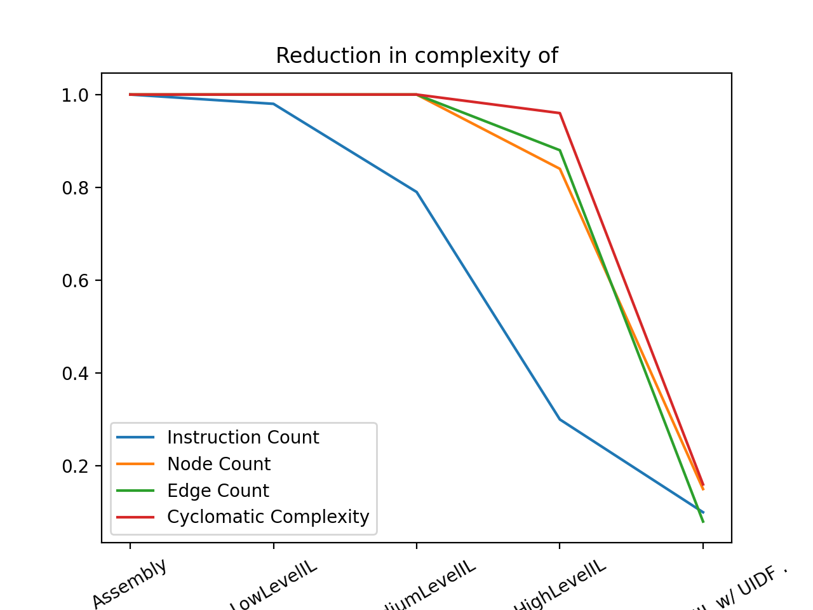

# UIDFStats

This script is an attempt to quantify the complexity reduction of various forms of Binary Ninja's IL representations. Additionally by leveraging [User Informed Dataflow (UIDF)](https://binary.ninja/2020/09/10/user-informed-dataflow.html) we attempt to quantify the potential reduction in complexity if the direction of each branch could be calculated apriori. We attempted to aproximate the reduction in complexity achieved if Binary Ninja's analysis could know which branches would be taken/not-taken along 3 individual metrics: number of nodes, number of edges, number of instructions and 1 aggregate metric: Cyclomatic complexity (edges - nodes + 2 * functions).

# HLIL w/ UIFD Methodology

 To demonstrate the potential reduction given by knowing the direction taken of each conditional branch, we identified a single MLIL `Variable` in the `condition` each `MLIL_IF` instruction. We then identified the definition of that instruction and set its value to the constant zero. We then re-analyzed the function and recalculated our metrics. It is obvious that simply setting a variable to zero doesn't provide an exact analog to a true knowledge, of what it would take to satisify/falsify the conditions in question, we do believe that this provides an analog, and was doable within short time constraints.
 
# Results

The results of this analysis were surprising. HLIL w/ UIFD performed remarkably providing a 92% reduction in edges, a 85% reduction in nodes, a 90% reduction in instructions and a 84% reduction in cyclomatic complexity.

